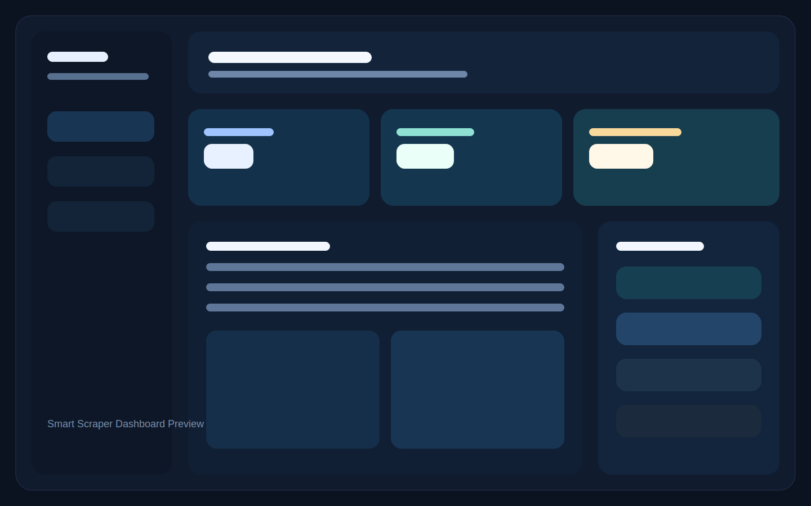
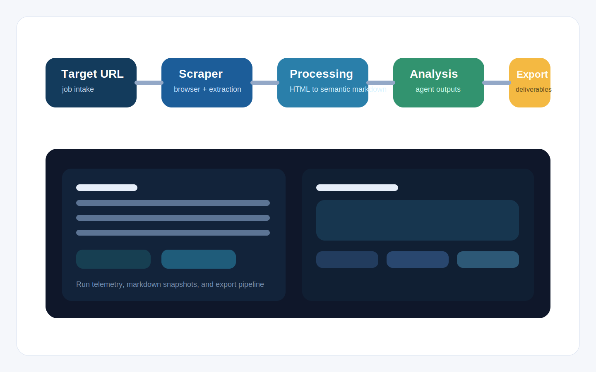

# Smart Scraper

[](frontend)
[](backend)
[](backend)
[](backend)
[](DEPLOYMENT.md)
[](LICENSE)

AI-powered multi-agent web scraping platform with a React frontend, FastAPI backend, Celery workers, and export-ready intelligence workflows.

## Overview

Smart Scraper is designed for end-to-end intelligent extraction workflows:

- create scraping jobs against dynamic sites
- orchestrate multi-step agent pipelines
- process raw HTML into semantic markdown and structured outputs
- store results, telemetry, and snapshots
- export outcomes for downstream teams and reporting

## Preview

### Dashboard Preview



### Pipeline Preview



## Core Capabilities

- Agentic scraping pipeline with orchestration, processing, and export stages
- SaaS-style authentication flows and API key support
- Stealth-capable scraping workflows and run telemetry
- Semantic markdown generation and result snapshots
- Export-ready output formats for reporting and delivery
- Queue-backed background execution with Celery workers

## Tech Stack

- Frontend: React, React Router, MUI, Tailwind CSS
- Backend: FastAPI, SQLAlchemy, Alembic
- Queue: Celery, Redis
- Scraping: Playwright, BeautifulSoup, lxml
- AI and orchestration: OpenAI, LangChain, LangGraph, CrewAI
- Storage and vector search: file storage, FAISS, NumPy

## Project Structure

```text
frontend/   React application
backend/    FastAPI app, workers, models, migrations, tests
design/     UI concepts and dashboard references
docs/       deployment notes and local environment docs
scripts/    helper scripts and local validation utilities
```

## Quick Start

### 1. Frontend

```bash
cd frontend
npm install
npm start
```

### 2. Backend

```bash
cd backend
python -m venv venv
source venv/bin/activate
pip install -r requirements.txt
uvicorn app.main:app --reload
```

### 3. Worker

```bash
cd backend
source venv/bin/activate
celery -A app.queue.celery_app worker --loglevel=info
```

## Environment

Common variables used locally and in deployment:

- `DATABASE_URL`
- `REDIS_URL`
- `SECRET_KEY`
- `CORS_ORIGINS`
- `PLAYWRIGHT_HEADLESS`
- `REACT_APP_API_URL`

Detailed environment and infrastructure guidance lives in [DEPLOYMENT.md](DEPLOYMENT.md).

## Deployment

Recommended production shape:

- frontend on Vercel
- backend API on Railway
- worker on Railway
- PostgreSQL on Neon, Supabase, or Railway
- Redis on Upstash or Redis Cloud

Helpful references:

- [DEPLOYMENT.md](DEPLOYMENT.md)
- [FOLDER-STRUCTURE.md](FOLDER-STRUCTURE.md)
- [docs/LOCAL_PORT_MAP.md](docs/LOCAL_PORT_MAP.md)

## Testing

### Backend

```bash
cd backend
pytest
```

### Frontend

```bash
cd frontend
npm test
```

## Suggested GitHub Description

`AI-powered multi-agent web scraping platform with FastAPI, React, Celery, Playwright, and export-ready intelligence workflows.`

## License

This project is licensed under the [MIT License](LICENSE).
